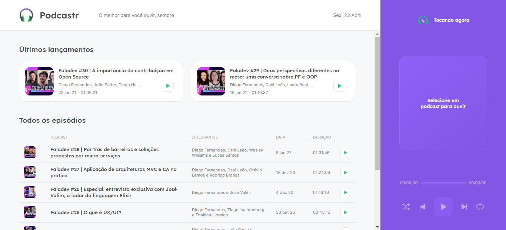

<h1 align="center"> 
    
</h1>

<h1 align="center"> 
    
</h1>

# 💻 Sobre o projeto
A plataforma **Podcastr** é utilizada para a reprodução de podcasts.

Projeto desenvolvido durante a 🚀 **NLW - Next Level Week** 🚀 - Oferecida pela **Rocketseat**

---

## 🚀 Tecnologias utilizadas
 - [ReactJS](https://reactjs.org/)
 - [Typescript](https://www.typescriptlang.org/)
 - [Next.js](https://nextjs.org/)

---

## 🚨 Como baixar o projeto
Antes de começar, você vai precisar ter instalado em sua máquina as seguintes ferramentas: Git, Node.js. Além disto ter um editor para trabalhar com o código como VSCode.

### 🏁 Para rodar a aplicação 

```bash

    # Clonar o repositório
    $ git clone https://github.com/milealmeida/nlw-starter-ecoleta

    # Entrar no diretório
    $ cd {nomedapasta}

    # Instalar as dependências
    $ yarn install

    # Iniciar o fake server do backend
    $ yarn server

    # Iniciar o projeto
    $ yarn dev

```

---
Desenvolvido por Milena Almeida 💙